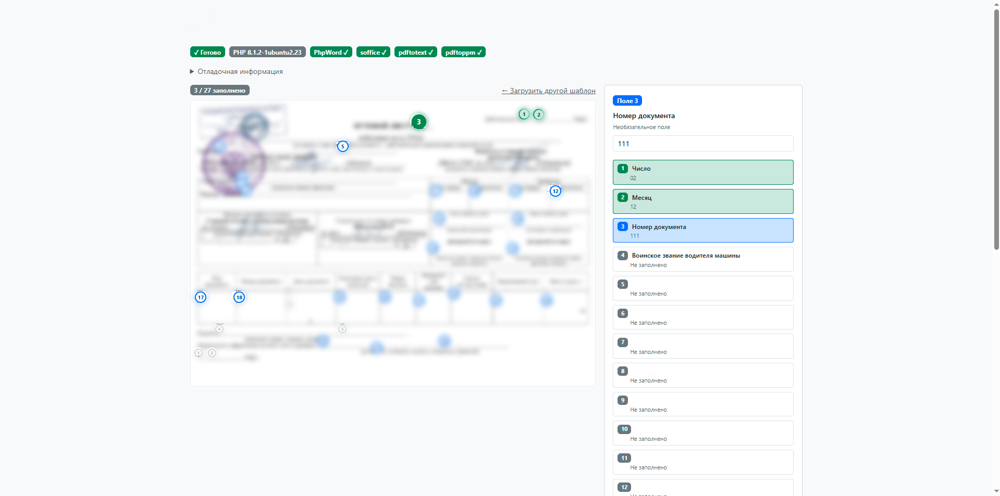

# DOCX → Интерактивный ввод

Конвертация шаблонов Word с переменными в виде плейсхолдеров `{name_type:text}` в интерактивные визуальные формы с нумерованными маркерами для пошагового ввода данных поверх изображения документа.



## Как это работает

1. **Парсинг переменных из DOCX XML** - извлечение переменных из шаблона: `word/document.xml`, колонтитулов
2. **Скрытие переменных** - (скорее всего костыль): установка цвета шрифта текста в белый (#FFF). Именно так текст сохраняет исходную ширину, оставляя разметку для PDF идентичной исходной. Если удалять - начинаются смещения позиций будущих флажков в документе.
3. **Конвертация в PDF** - через LibreOffice headless (`soffice --convert-to pdf`)
4. **Извлечение позиций** - `pdftotext -bbox` возвращает XML с координатами слов. Каждая переменная сопоставляется с полями через разрешение имён.
5. **Генерация JPEG** - `pdftoppm -jpeg` из того же PDF.
6. **Наложение маркеров** - на фронте позиционируются нумерованные кнопки по процентным координатам поверх изображения.

### Стратегии сопоставления переменных

Паттерны `{var}` в документах Word часто разбиваются по нескольким XML `<w:r>` ранам. После реконструкции сопоставление полей выполняется тремя стратегиями в порядке приоритета:

| Стратегия | Паттерн | Пример |
|-----------|---------|--------|
| 1. Имя+тип с двоеточием | `{name_type:Label}` | `{customer_text:ФИО заказчика}` |
| 2. Имя+тип без двоеточия | `{name_type}` | `{date_date}` |
| 3. Префикс (≥3 символа) | `{dat...}` → `date` | Короткий префикс, когда единственное поле |

## Системные требования

- **PHP ≥ 8.1** с расширениями `zip`, `dom`, `simplexml`
- **LibreOffice** (headless) - `apt install libreoffice-core`
- **poppler-utils** - `apt install poppler-utils` (содержит `pdftotext`, `pdftoppm`)
- **Composer** - для `phpoffice/phpword`
- **Node.js + npm** - удобно

## Установка

### Через npm

```bash
cd папка проекта
npm install
npm run deps

# Проверка зависимостей
npm run check

# Запуск PHP dev-сервера
npm run dev
```

### Напрямую через Composer

```bash
cd forgit
composer install

# Проверка зависимостей
php -r "require 'vendor/autoload.php'; print_r(DocxCard\DocxConverter::checkDependencies());"

# Запуск PHP dev-сервера
php -S localhost:8080 -t public router.php
```

## Структура проекта

```
├── composer.json
├── router.php                  # Роутер
├── public/
│   └── index.html              # Минимальный SPA-фронтенд (без зависимостей, тестовое отображение и функциональность)
├── api/
│   ├── convert.php             # POST: загрузка файла DOCX → конвертация → изображение + маркеры
│   ├── fill.php                # POST: заполнение шаблона данными → скачивание DOCX
│   └── status.php              # GET: проверка системных зависимостей
├── src/
│   ├── DocxConverter.php       # Ядро: процесс конвертации, заполнение
│   └── FieldExtractor.php      # Извлечение координат полей из PDF
└── storage/                    # Создаётся автоматически: загруженные шаблоны и результаты
    ├── templates/
    └── output/
```

## Формат шаблона переменных для DOCX

```
{fieldName_fieldType:Пояснение для человеков}
```

Примеры:
- `{customer_text:ФИО заказчика}` - текстовое поле
- `{birthdate_date:Дата рождения}` - выбор даты
- `{phone_phone:Телефон}` - поле телефона
- `{count_number:Количество}` - числовое поле
- `{notes_textarea:Примечания}` - многострочное поле

Упрощённые паттерны:
- `{customer:ФИО}` - тип по умолчанию `text`
- `{customer}` - имя поля становится меткой

## Лицензия
MIT

Впервые было успешно использовано в продуктиве на сайте проекта mp-mil.ru